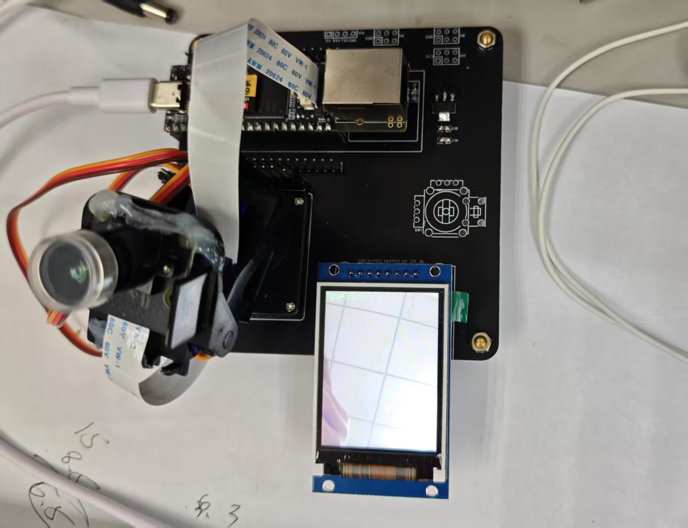

# Intelligent_Recognition_Client

> 基于 Rockchip RKNN 的智能识别客户端：集视频采集、目标检测、TCP 通信与云台控制于一体，适配 RK 平台嵌入式设备。

<p align="left">
  
  
  
  
  
  
  
  
</p>



---

## 目录
- [项目概述](#项目概述)
- [核心功能](#核心功能)
- [使用教程](#使用教程)
- [框架设计](#框架设计)
- [项目结构](#项目结构)

---

## 项目概述 🧭
Intelligent_Recognition_Client 是一个面向 Rockchip 平台的边缘侧智能识别客户端，基于 RKNN Runtime 运行 YOLOv5 模型进行实时目标检测。项目采用解耦式架构：由 Control 统一编排 Video（采集/推理）、TcpClient（联网通信）与 Servo（云台控制），并支持将检测结果进行聚合与限频发送，适合部署在 RK 系列开发板上与上位机/服务端配合使用。

---

## 核心功能 🚀
- 🎯 实时目标检测：
  - 使用 YOLOv5 RKNN 模型（默认输入 640×640）进行多目标检测。
- 📦 结果聚合与限频发送：
  - 在 Control 内统一聚合同帧/多目标结果；默认每秒最多上报 1 次，可配置发送间隔。
- 🌐 TCP 客户端通信：
  - 独立线程维护连接并自动重连；对外发送结构化检测摘要，便于上位机解析。
- 🎛️ 云台联动（可选）：
  - 预留 Servo 接口，可按业务需要实现跟踪/转向等逻辑。
- 🛡️ 稳健与可维护：
  - 支持 SIGTERM 安全退出；模块职责清晰，易于移植与扩展。

---

## 使用教程 📘
### 1) 安装依赖环境
参考官方环境搭建文档：<https://wiki.luckfox.com/zh/Luckfox-Pico/Luckfox-Pico-SDK>

```bash
sudo apt update && \
sudo apt-get install -y \
  git ssh make gcc gcc-multilib g++-multilib module-assistant expect g++ gawk texinfo \
  libssl-dev bison flex fakeroot cmake unzip gperf autoconf device-tree-compiler \
  libncurses5-dev pkg-config bc python-is-python3 passwd openssl openssh-server \
  openssh-client vim file cpio rsync curl
```

### 2) 获取最新的 SDK
```bash
git clone https://gitee.com/LuckfoxTECH/luckfox-pico.git
```

### 3) 拉取本工程
```bash
git clone https://github.com/RaidKaeil01/RV1106_Client.git
```

### 4) 进入代码并修改配置
- 修改 CMake 文件的 SDK_PATH，将此处路径设置为你第 2 步获取的官方 SDK（luckfox-pico）路径：
```cpp
set(SDK_PATH "/home/mingxing/luckfox-pico")
```
- 修改 `code/src/main.cc`，将此处的 IP 地址修改为你虚拟机的 IP 地址：
```cpp
TcpClient* g_tcp = new TcpClient("192.168.1.156", 8890);
```
- 修改 `run.sh`，将此处 IP 地址修改为你 RV1106 开发板的 IP 地址：
```bash
scp -r install/ root@192.168.1.130:/root
```
> ⚠️ 注意：确保虚拟机与 RV1106 在同一局域网下。

### 5) 编译并运行
- 编译程序并将可执行程序传入开发板：
```bash
./run.sh
```
- 切换到 RV1106 开发板终端执行（确保本地 QT 端已打开）：
```bash
cd /root/install
./Intelligent_Recognition_Client
```

---

## 框架设计 🧱
```
[Camera/RTSP]
     │
     ▼
Video(采集/预处理/RKNN推理/后处理)
     │  onObjectDetected()/onDetectionSummary()
     ▼
Control(聚合/限频/调度) ──────► Servo(云台联动)
     │
     └──────────────► TcpClient(连接/自动重连/发送)
                              │
                              ▼
                         Remote Server
```
- 线程模型：
  - 主线程：模块装配、命令交互与生命周期管理。
  - Video 线程：采集/推理/后处理，构建检测摘要并上报。
  - TCP 线程：维护连接、自动重连、发送/接收。
- 关键交互：
  - `Video::setControl(Control*)` 绑定上报目标；
  - `Control::onObjectDetected()/onDetectionSummary()` 聚合并限频；
  - `TcpClient::setControl(Control*)` 与 `TcpClient::sendData()` 对外通信。
- 发送节流：
  - 基于时间戳的限频策略（静态局部变量实现），默认 1 Hz，可通过 `Video::setSendInterval(ms)` 覆盖。

---

## 项目结构 🗂️
- 代码主体
  - `code/src/main.cc` 主入口，装配模块、管理启动/停止与安全退出。
  - `code/modules/control/` 业务主控，聚合检测结果并限频发送，协调 TCP 与云台。
  - `code/modules/video/` 采集/预处理/RKNN 推理/后处理，上报检测摘要。
  - `code/modules/tcp/` TCP 客户端，连接与自动重连、数据发送与接收。
  - `code/modules/servo/` 云台控制（硬件相关）。
  - `code/include/common.h` 项目级公共声明。
  - `code/model/` 模型与资源：`yolov5.rknn`、`anchors_yolov5.txt`、`coco_80_labels_list.txt`。
- 平台与第三方
  - `include/` RKNN、RGA、Rockchip MPP、OpenCV 等平台/第三方头文件。
  - `3rdparty/` 外部依赖（如 allocator）。
- 构建与产物
  - `CMakeLists.txt` 顶层构建配置；`build/` CMake 生成的编译产物。
  - `install/` 安装输出；`lib/` 预置库（glibc/uclibc）。
- 其他
  - `images/` 示例图片；`run.sh` 运行脚本；`example/` 示例工程。


